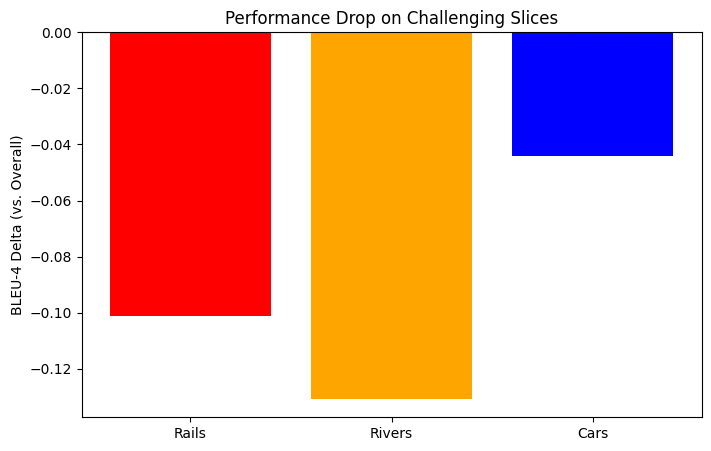
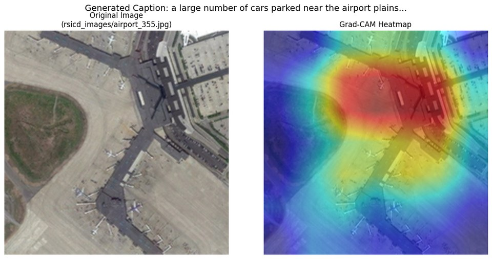
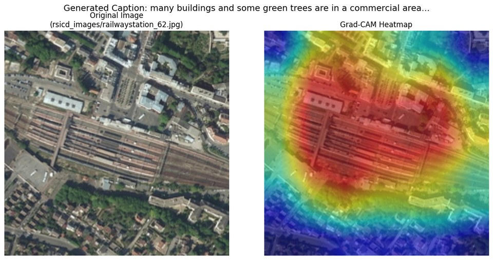
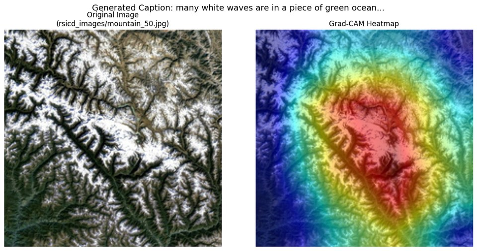
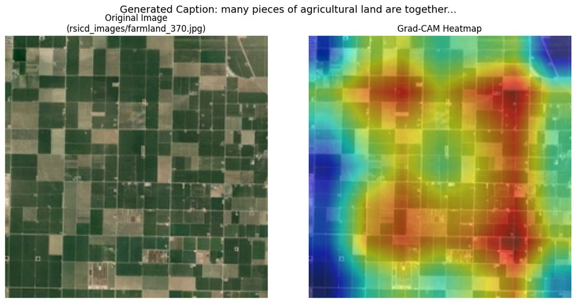

# Captioning satellite imagery

Encoder-decoder image captioning on [RSICD](https://github.com/201528014227051/RSICD_optimal), the 10,921-image remote-sensing caption dataset. Two ImageNet CNN encoders (ResNet-18, MobileNetV2) crossed with two decoders (LSTM, Transformer), trained on cached features so a full run takes minutes, then evaluated with BLEU and METEOR, sliced by scene type, and probed with Grad-CAM to find out where the encoder is actually looking when it gets a caption wrong.

The short version: the Transformer decoder beats the LSTM by 6 to 7 BLEU-4 points on either backbone, MobileNetV2 edges out ResNet-18 despite being the smaller model, and the three characteristic failure modes all trace back to a single design choice, global average pooling in the encoder.

## Results

Test split, 1,093 images, beam width 3 for LSTM, greedy for Transformer.

| Encoder | Decoder | BLEU-1 | BLEU-2 | BLEU-3 | BLEU-4 | METEOR | Length |
| --- | --- | ---: | ---: | ---: | ---: | ---: | ---: |
| ResNet-18 | LSTM | 0.534 | 0.342 | 0.240 | 0.175 | 0.369 | 9.98 ± 2.42 |
| MobileNetV2 | LSTM | 0.542 | 0.351 | 0.245 | 0.177 | 0.378 | 9.80 ± 2.40 |
| ResNet-18 | Transformer | 0.629 | 0.433 | 0.319 | 0.239 | 0.452 | 10.46 ± 2.56 |
| **MobileNetV2** | **Transformer** | **0.637** | **0.446** | **0.332** | **0.251** | **0.460** | 10.43 ± 2.65 |

None of the four models produced a degenerate repetition (three identical tokens in a row) on any test image.

### Where it fails

BLEU-4 of the best model on three keyword-defined slices of the test set, against its overall 0.251:

<p align="center"></p>

| Slice | n | BLEU-4 | vs overall |
| --- | ---: | ---: | ---: |
| captions mentioning *rails* | 23 | 0.150 | −0.101 |
| captions mentioning *rivers* | 21 | 0.121 | −0.131 |
| captions mentioning *cars* | 134 | 0.207 | −0.044 |

Grad-CAM over the encoder's last BatchNorm layer, with the summed feature vector as the target, shows why. Three representative mis-captions:

**Airport read as a car park.** Generated: *a large number of cars parked near the airport plains.* Reference: *many white planes are parked at the airport.* The heatmap sits on the terminal building and the lot behind it. The aircraft on the apron are a few pixels each at 224×224, and global average pooling collapses them into the surrounding tarmac before the decoder ever sees them.

<p align="center"></p>

**Railway station read as a commercial area.** Generated: *many buildings and some green trees are in a commercial area.* Reference: *the pin-shaped rails covered with four red-banded ceilings are surrounded by houses.* Only 23 test images mention rails at all; the decoder has almost no signal for the concept and falls back on its highest-prior scene type.

<p align="center"></p>

**Snowy mountain read as ocean.** Generated: *many white waves are in a piece of green ocean.* Reference: *the snowy mountain is green and brown.* White drifts over green and brown terrain have the same high-frequency texture as foam on water. An encoder pretrained on ground-level ImageNet photos has no aerial concept of a mountain, so texture wins.

<p align="center"></p>

For contrast, a case that works, where the heatmap covers the actual field boundaries:

<p align="center"></p>

The obvious next step is to keep the encoder's spatial feature map and let the decoder attend over it instead of a single pooled vector. All three failures are symptoms of throwing that spatial information away.

## Run it

```sh
pip install -e ".[data,gradcam,test]"

python scripts/prepare_data.py                          # RSICD from the HF hub -> data/{train,valid,test}.csv
python scripts/cache_features.py --backbone mobilenet_v2   # one .pt per image -> features/mobilenet_v2/{split}/
python scripts/train.py --decoder transformer --backbone mobilenet_v2
python scripts/evaluate.py --checkpoint checkpoints/mobilenet_v2_transformer.pth --slices rails rivers cars
python scripts/gradcam.py --checkpoint checkpoints/mobilenet_v2_transformer.pth --image airport_355 --save cam.png
```

`--backbone resnet18` and `--decoder lstm` give the other three configurations. Training runs on CUDA, Apple MPS, or CPU; 20 epochs of the Transformer on cached MobileNetV2 features takes a few minutes on a laptop GPU.

```sh
pytest tests/     # tokenizer, model shapes, and decoding, no data needed
```

## How it works

**Feature caching.** Each encoder is run once over every image and the pooled 512- or 1280-dim vector is saved to disk. Decoders train against those files, so an epoch is bounded by the LSTM or Transformer, not by ResNet. It also makes the four-way comparison clean: every decoder sees exactly the same encoder output.

**Tokenizer.** RSICD captions are messy. The stringified caption list often runs sentences together, and the raw text contains tokens like `boats.a` and `circle.some` where a period sits between words with no space. A first tokenizer that kept only alphabetic tokens silently dropped every one of these. The fix splits any non-alphabetic token on runs of letters, and the vocabulary went from silently lossy to 2,690 tokens with 100% train coverage and 0.93% validation OOV.

**Caption length.** Max length is the 98th percentile of tokenized training-caption length (18) plus BOS and EOS plus two of slack, giving 22. That truncates 0.78% of training captions.

**LSTM decoder.** The image feature is concatenated to every word embedding rather than used only to initialise the hidden state, so the decoder can't drift away from the image over a long caption. Decoding is beam search, width 3, with length-normalised scoring.

**Transformer decoder.** The pooled feature is projected to four `d_model`-sized memory tokens and layer-normalised; a standard four-layer causal `nn.TransformerDecoder` cross-attends to them. Decoding is greedy.

**Training.** Adam at 2e-4, StepLR ×0.1 every 7 epochs, 20 epochs, batch 64, cross-entropy with padding ignored. Gradient norm clipped to 1.0: without it the LSTM's language-model loss swamps the image signal in the first few epochs and captions become generic.

**Metrics.** Corpus BLEU-1 to BLEU-4 and per-caption METEOR (NLTK), plus generated-length statistics and a repetition check for three identical consecutive tokens.

## Layout

```
rscap/
  data.py        caption cleaning, Vocabulary, feature-cached CaptionDataset
  encoders.py    CNNEncoder (resnet18 | mobilenet_v2), pooled features
  decoders.py    LSTMDecoder, TransformerDecoderModel, wrappers, masks
  train.py       training loop, metrics, device selection
  analysis.py    keyword slices, Grad-CAM
scripts/         prepare_data, cache_features, train, evaluate, gradcam
tests/           smoke tests (no data needed)
results/         figures used above
notebooks/       the original end-to-end walkthrough, outputs kept, images stripped
```

## Dataset

Lu, Wang, Zheng, Li. *Exploring Models and Data for Remote Sensing Image Caption Generation.* IEEE TGRS, 2017. Splits from the `arampacha/rsicd` Hugging Face mirror: 8,734 train, 1,094 valid, 1,093 test.

## Author

Arnav Agarwal, IIT Bombay. [arnavagarwal05.github.io](https://arnavagarwal05.github.io)
